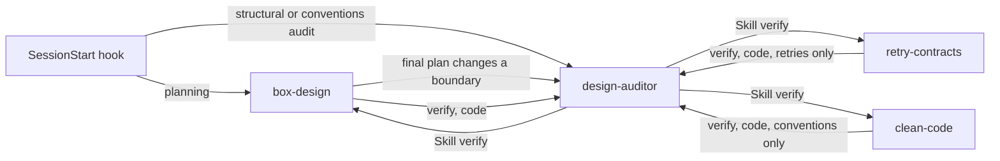

# serenity-valley

Claude Code plugin marketplace. Each plugin lives in `plugins/<name>/` and is listed in `.claude-plugin/marketplace.json`.

## Conventions

- **Skills hold knowledge and rules. Agents hold roles.** An agent that needs rules invokes the skill (`Skill` in its `tools`, `browncoat:<skill> <mode>` in its body) — never copy rules into an agent body. Every rule lives in exactly one place.
- Prefer invoking over `skills:` preloading when the skill reads its own `references/`: the skill's `allowed-tools` grants those reads, which a subagent otherwise lacks (plugin files sit outside the working directory).
- Skills are general-purpose design and development practice. They must defer to project/org guidance on specifics (see the Precedence section in `box-design`), since they are installed alongside org-specific marketplaces.
- Diagrams in `docs/` and skill references are Mermaid, not ASCII — explicit nodes and edges read better for people on GitHub/Obsidian and for models. Keep them small.
- Heavy reference material goes in a skill's `references/` and is loaded on demand; keep `SKILL.md` focused.
- Reference bundled files with `${CLAUDE_SKILL_DIR}` in skills and `${CLAUDE_PLUGIN_ROOT}` in agents. Never hardcode paths.
- Plugin agents ignore `hooks`, `mcpServers`, and `permissionMode` frontmatter.
- **Never set `version`** in `plugin.json` or `marketplace.json`. The commit SHA is the version, so every push to `main` reaches installed machines.
- Entry `name` in `marketplace.json` must match `name` in the plugin's `plugin.json`.
- Don't add empty `hooks/hooks.json` or `.mcp.json` placeholders.
- `docs/` holds the talks behind the skills — source material and design intent, not shipped with any plugin. Files are `NN-slug.md`, numbered by reading order; renumber with `git mv` to insert, and keep `docs/README.md` in sync.
- When a skill changes, check it still honours its talk, and update the talk if the thinking moved.

## Routing and handoffs

How browncoat's hook, skills, and agent hand off to each other. Keep these invariants when editing any of them.



- The hook routes; it never restates a rule. Each gate lives in one skill, and the hook points to it.
- Phrase each routing line positively, naming what its target checks (`design-auditor`: structure and conventions). A bare "audit", "verify", or "review" is too broad to route on. Keep the lines short: the target's `description` and `when_to_use` carry the detail.
- The auditor runs on a plan once, and only when the final plan changes a boundary. It doesn't run for discussion, single-box changes, or after every `box-design` load.
- `design-auditor` has no `Agent` tool. That keeps the skills it invokes from delegating back to it. Don't add one.
- A delegation prompt states its scope, because the auditor runs all three checklists unless told otherwise.
- When you edit the hook, an agent description, a skill's `description` or `when_to_use`, or a delegation sentence, re-run the routing checks and update the README hook row.

## Checks

```sh
claude plugin validate .   # the "No version specified" warning is expected

# Routing: list the agents and skills a prompt invokes, using the local copy only.
claude -p --plugin-dir ./plugins/browncoat \
  --settings '{"enabledPlugins":{"browncoat@serenity-valley":false}}' \
  --max-turns 10 --output-format stream-json --verbose "<prompt>" < /dev/null 2>/dev/null \
  | jq -c 'select(.type=="assistant") | .message.content[]? | select(.type=="tool_use" and (.name=="Agent" or .name=="Skill")) | {name, agent: .input.subagent_type, skill: .input.skill, args: .input.args}'
```

Routing prompts to re-run: "audit the codebase for correctness" (no auditor), "audit the codebase for layering and coupling" (auditor), `/browncoat:retry-contracts verify` (auditor asked for retries only).

Test changes without installing: `claude --plugin-dir ./plugins/browncoat`, then `/reload-plugins` after edits.
