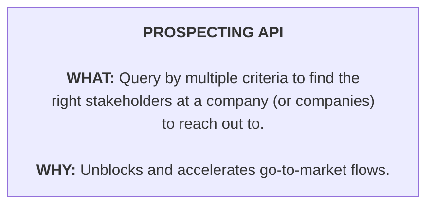
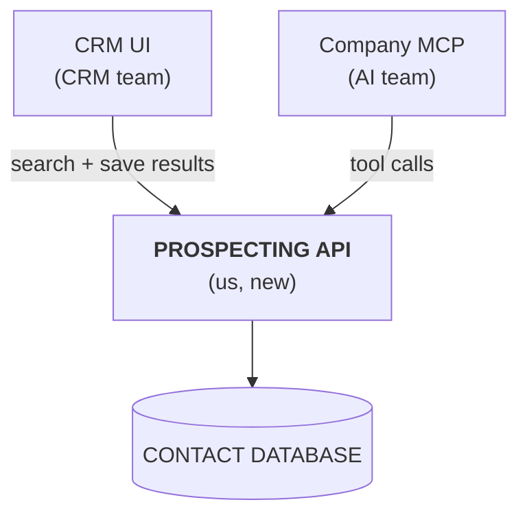
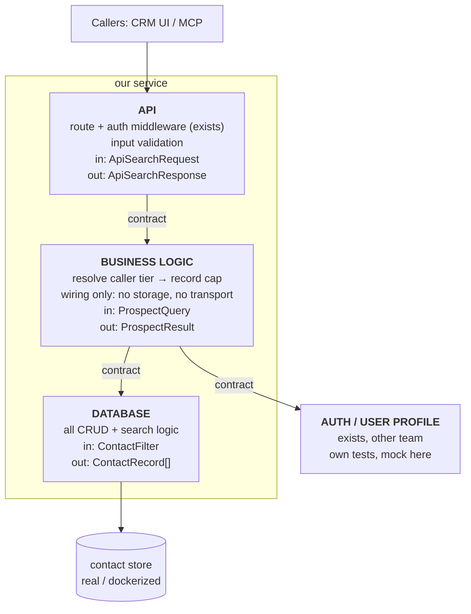

# Everything's a Box in a Box

## Summary

This talk shows that everything — concepts, products, features, applications, pipelines, databases — can be thought of as a box, and that how deep you go into those boxes depends on who you're talking to.

It then shows how boxes at the implementation level map to good development and coding practices.

## Zooming in, box by box

### 50,000 ft

So, everything's a box in a box! No, really! Let's start at the top, with the 50,000 ft view. This is the level at which you discuss products with leadership, give elevator pitches, and convince stakeholders that whatever you're building is worth it, without getting dragged down into the details of how.

For the rest of this talk we'll use a contrived example, which we'll pretend is new, novel, groundbreaking, and about to change the industry :P — an API that queries a database and returns different responses based on the contents of the rows. Groundbreaking, right? Well, no, but it's easy to follow, and the ideas extend far beyond it. We'll also assume the business already has systems for user profiles, auth, and contact sourcing and storage.

At the 50,000 ft view, this is just one box. That box describes the system: what is this thing, what does it do, and what problem does it solve? Here, we'll describe it as a prospecting API that lets callers query by multiple criteria to find the stakeholders at one or more companies to reach out to — a game changer for go-to-market flows.

As you can see, it's short, sweet, and to the point about the problem it solves. This is how you sell or pitch an idea.

### 10,000 ft

The next level is the 10,000 ft view. This is where you show in more detail how the product or feature is structured, and how it connects to and integrates with other systems.

"What about the boxes?" you say. "I was promised boxes!" Alright, alright. We just zoom into the 50,000 ft box and, lo and behold, it becomes multiple boxes!

*Existing systems (auth, user profiles, contact sourcing) are assumed and not drawn.*

We have the API; the database; the CRM UI, which calls the API; and the MCP, which uses the API to hook the functionality into agents. Whoa, four boxes now! You asked, I delivered!

So what's the point of the 10,000 ft view? It gives a high-level understanding of the new system, going beyond the what and the why into the how. Looking at these four boxes, you can see that to make this work we'll need to talk to the CRM team about adding prospecting results to the existing CRM product, and to the AI team about building a new company MCP or integrating with an existing one.

The 10,000 ft view is for engineering managers, product managers, and engineering leads. It's what they use to have those conversations, make product plans, and coordinate building the new product across multiple teams. The low-level how isn't needed to have those conversations, negotiate timelines and headcount, or get things on the roadmap. Too much low-level detail can stall these conversations, or make the requirements seem larger than they really are, because each team only takes a portion of that detail. Nobody needs to know everything, especially the parts another team owns and is fully responsible for.

### Implementation

I hope you're starting to see the pattern. Now let's dive into the implementation level. Whoa! Many more boxes. In fact, several teams have implementation boxes of their own — the MCP team has theirs, the CRM team has theirs. For brevity, we'll focus on the team that owns the new system.

*Every box owns its payloads and its own tests; each arrow is a contract.*

How many boxes this time? Let's see.

**The database box.** One box for the database interaction layer; let's assume nothing existed before for searching contacts. This box contains all the database CRUD logic, defines the input and output payloads for each operation, and has dedicated tests that run against a real, dockerized, or test database of some sort. This is the database interface contract.

**The API box.** This box contains the API's input and output payloads, input validation, and the auth hooks — normally middleware, which, as mentioned, already exists. It defines the interface contract into the prospecting product itself, and it's arguably the most important contract to define, because it sits at the edge of the product, where other teams will interact with it.

**The business logic box.** First, what is business logic? It's really just the wiring of multiple boxes together to get the desired behaviour. It's its own box for a reason we'll get to later. In our example, let's keep it simple: it defines its own input and output payloads, takes the required search and auth information, determines which tier the caller is on, adjusts the number of records they're allowed to receive accordingly, calls the database box, and returns the result.

Before we dive deeper, one important note. It may be tempting to reuse the API's input payload as the business logic's input, or to pass the database output straight through as the business logic's output — maybe even as the API's output too. Resist this urge! Each box should have its own. Especially when the product is new, the inputs and outputs look almost the same, if not identical. But they *will* diverge, I promise you, and if the payloads are shared, these pieces won't be able to evolve independently. In the long run, that hurts the composability of your system.

### What the boxes are for

So: boxes! Many boxes at this level. What are they used for? Not only for building the system. Once the interface contracts are defined, the other teams you need help from are unblocked. They can build their pieces in parallel, mocking data as they go, with integration into your API being the very last piece.

Let's go one level deeper. These boxes naturally map to the pieces, or steps, of building your project. They show which pieces need to exist before others can be built, which gives you the build order. That in turn shows what can be built in parallel and what is blocked, which then gives you your project's milestones. This holds no matter the size of the project. Think of it as setting up dominoes: it seems tedious, BUT remember what happens after you set up the dominoes... you get to knock them down, and that part is FAST! At that point, it's pure execution.

### Testing each box

That's a bunch of good reasons already, but there's one more concept that keeps your code, systems, and products flexible, saves time, and lets you easily change or expand your products. It boils down to composability. We touched on it with the database box and its tests, so let's work upwards from there.

The database is the lowest level, and most of the time we can test against the real thing in one form or another. So we build this piece along with tests that cover all of its functionality.

Next is the business logic. It needs to call the auth/user profile service to learn the caller's tier, and the database, and it needs tests too. But here's the thing: I don't need to test the database or the auth service code. I can mock those in the tests. All I need to test is that the business logic is wired correctly and the right calls are made. I see this mistake made all the time! Seriously, you don't need to test the other parts; they have their own dedicated tests already proving they work. What you test in the business logic is the wiring.

Then there's the API. It contains the auth middleware and calls the business logic. Again, the business logic has its own dedicated tests, just like the auth service should, so it can be mocked away in the API tests, leaving only the API itself to test.

I hope that, even in this very simple product, you can see how much time we save by not re-testing what's already tested. More importantly, your code and tests are decoupled and can evolve independently, unless an interface contract changes.

If you're thinking, "But then how do you know the product works end to end?" — that's what integration tests are for, as opposed to the unit tests we've been talking about. There's something new to learn here too: that's where the line between unit and integration tests sits. Integration tests, much like business logic, test the wiring between multiple things, but from the product's perspective.

### Composability

And now, finally, the best part: composability. Keeping your boxes decoupled, with no abstraction leakage, makes it easier to refactor, add, remove, and change components. Don't believe me? Here are a few examples.

1. **Leadership wants the enterprise tier to get more results than it did before.** What do we do? Adjust the business logic and its test... that's it! Recompile and deploy. We didn't need to worry about the API or the database at all.
2. **We need to add rate limiting to the API**, because some people are abusing our liberal use policy. We add rate limiting to the API, adjust its tests, recompile, and deploy... without ever having to think about the business logic or the database.
3. **We need to completely change the database backend**, because the old one can't handle the load. So we replace the entire backend and adjust the database code, and as long as we didn't break the interface contract, we never have to think about the API or the business logic again — not even to adjust their tests.

Example 3 also touches on another benefit of composability: reusability! Here are some examples:

1. **We want to build an enrichment product on top of the same contact data.** Sweet, we can reuse the database box we already have! It's decoupled from the prospecting business logic and entrypoint, so we can just pick up that database module and use it — provided we've properly separated it using our language's mechanisms for compilation and composition.
2. **We want to offer a higher-performance gRPC integration alongside the API.** What do we do? Build the gRPC layer and pick the business logic up off the shelf.

I hope you can see why building things this way solves not only the current requirements but also a lot of unforeseen future ones. Honestly, it doesn't slow you down; it usually takes only a few extra minutes to plan the boxes you need.

One more warning. This may sound like everything should be self-contained, with its own structure and its own tests, but there is such a thing as too DRY — leftpad, I'm looking at you! The separation comes from separating responsibilities: the storage/database layer vs. the business logic vs. the exposure layer, like the API.

## Final thoughts

Which view you discuss depends heavily on your audience.

- **Leadership** doesn't want to hear about the low-level code and the how. They care about the what and the why: the 50,000 ft view.
- **Engineering managers, team leads, and product** need to know more. They also need the how, so they can work with other teams on integration — in this case, the CRM team adding functionality on their side, and the AI team that manages your company's MCPs. The 10,000 ft view is everything in the 50,000 ft view plus a bit of the general how, mainly for a high-level understanding of the system.
- **Engineers** building the system need more than the high-level details. They need to think about the building blocks, the interface contracts between boxes, and the edges between teams and technologies. That's the implementation view.

Remember: great software is built from multiple boxes, like Lego! And business logic is the wiring of lower-level boxes together.

---

Next: [The Failure Path Is an Arrow](02-the-failure-path-is-an-arrow.md) — contracting the arrow errors travel along, and where retries belong.
