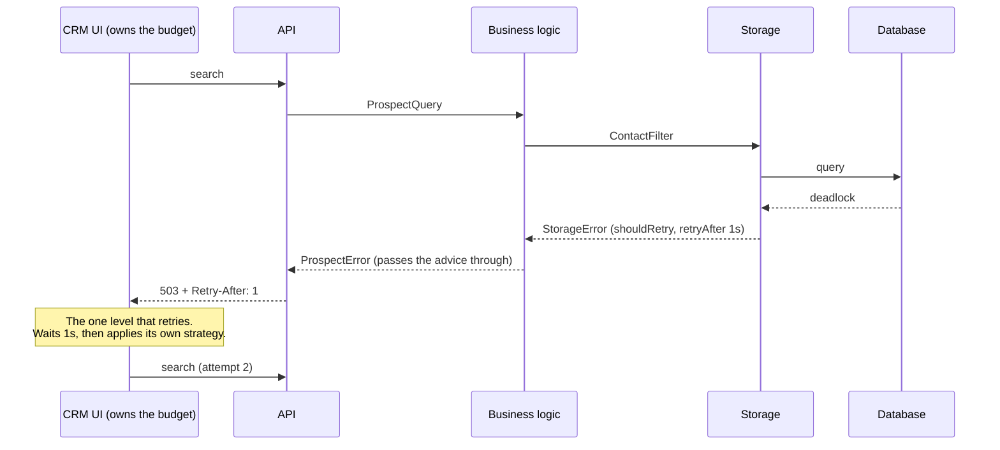
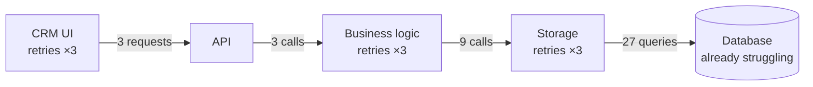
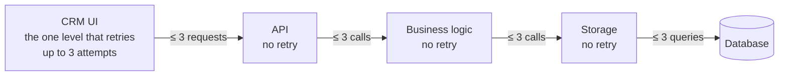

# The Failure Path Is an Arrow

## Summary

In [Everything's a Box in a Box](01-everything-is-a-box-in-a-box.md), every arrow between boxes was a contract. But we only drew the happy path. This talk covers the other arrow — the one errors travel along — and how to contract it: one error type per box, classifying failures where they happen, and letting each box tell its callers whether, and when, to retry.

It then covers where retries belong, why nested retries are one of the easiest ways to take down your own system, and how to make sure it never happens.

## Contracting the failure path

### The arrow nobody draws

Remember our groundbreaking Prospecting API? API box, business logic box, database box, each with its own payloads, each arrow a contract. Beautiful. Now let's ask what happens when the database has a bad day.

In most codebases, here's what happens: the database driver throws some driver-specific error, the business logic lets it fly straight past, and the API catches it and returns a 500. Congratulations — your database driver is now part of your API contract! Every box the error passed through is now coupled to a technology it was supposed to know nothing about.

The failure path is an arrow like any other. It's just the one that almost always gets left uncontracted.

### One error type per box

The fix starts simple: each box publishes one error type of its own. It carries a message and, where a caller genuinely needs to act differently, a reason — an enum the box owns, like `DuplicateEmail`. The API box maps the business logic's reasons to status codes without ever knowing what a database is.

And one thing that is *not* an error: not finding something. That's part of the method's contract. Looking for one or more? Return an empty list. Looking for zero or one? Return an optional. Nothing failed, so there's no error to return.

Note: one type per *box*, not one per *operation*. It's tempting to make `SearchContactsError`, `CreateContactError`, `UpdateContactError`... resist! Per-operation types force a branch at every call site and make generic handling — like retries, which we'll get to — impossible.

### Classify at the boundary

Where does a driver error become the box's error? Inside the box that owns the driver, and nowhere else. The database box knows that its particular database's deadlock code means "try again" and its unique-violation code means "duplicate". Nobody above it should ever need to know.

Put that classification in a reusable helper, not in the error type's ancestry. If your error type extends the driver's error type, the driver has snuck right back into your contract, and swapping the backend — remember example 3 from the last talk? — breaks everything upstream.

### Wrap deliberately

Not every error should be wrapped, though. There are three categories, with three different answers:

1. **Operational failures** — unreachable store, write conflict, timeout, malformed query. Wrap and classify. These are why the contract exists.
2. **Programming defects** — bad argument, broken invariant, null dereference. Let them propagate raw. Wrap a bug as an operational failure and someone will happily retry a deterministic crash, while the real origin gets buried.
3. **Cancellation and environment signals** — shutdown, interruption, a deadline from above, out of memory. Never wrap these. They're not the box's to interpret, and swallowing a cancellation breaks the caller's ability to stop work.

And when you do wrap, preserve the cause. Keeping the underlying error reachable isn't a leak: the box's error is the contract, the cause is for diagnostics. Callers can unwrap it for logging, but never for ordinary control flow.

### Should I retry? Ask the box

Here's where most code goes wrong. Something fails, and the caller has to decide whether to retry. So what does it do? It digs into the error — checks the HTTP status, pattern-matches the driver code, maybe even string-matches the message. Every one of those is the caller reaching inside another box. Abstraction leakage, again!

And it's not just coupling. To check a driver's error code, the caller has to import the driver. Now your API depends on a database library it never calls, pulling in dependencies and bloat just to inspect an error that should never have crossed the boundary in the first place. A caller doesn't need to know what the underlying error was. It only needs to know whether to retry.

The box that produced the error is the only one that knows whether retrying makes sense. So let the box say so, through its error.

Define **one** retry interface, `Retryable` — interface, trait, whatever your language calls it — that every error type implements. Define it centrally, as reusable code for the whole codebase or company: one shared library per language, which every box and every service depends on. It has exactly two methods:

1. **`shouldRetry()`** — whether the caller should retry.
2. **`retryAfter()`** — optionally, how long to wait before retrying.

Why `shouldRetry` and not `isRetryable`? Because "is retryable" and "should be retried" aren't the same thing. Take HTTP: some status codes are retryable by definition, but a 500 technically isn't... and yet plenty of APIs document that you should retry on a 500. `shouldRetry` covers both: the box decides, using the protocol's guarantees plus whatever that API documents or your company's policy says, and the caller just asks. I know, I don't agree with retrying a 500 either, but our code lives in the real world, which isn't always ideal or within our control.

`retryAfter` lets any box announce backoff expectations — a database telling you to back off for a second, or an HTTP API passing along its `Retry-After` header. When there's no opinion, it returns nothing, and the caller's strategy decides.

A sketch in a few languages:

```go
type Retryable interface {
	ShouldRetry() bool
	RetryAfter() (time.Duration, bool)
}
```

```rust
pub trait Retryable {
    fn should_retry(&self) -> bool;
    fn retry_after(&self) -> Option<Duration> { None }
}
```

```java
public interface Retryable {
    boolean shouldRetry();
    default Optional<Duration> retryAfter() { return Optional.empty(); }
}
```

Why one interface for everything? Two reasons:

1. **Consistency.** Every error in the codebase answers the retry question the same way, so nobody has to remember how each box does it.
2. **Generic retry logic.** Build a retry helper once, and it works with *any* error from *any* box, without knowing anything about where the error came from. No abstraction leakage, no caller deciding for another box. We'll build one in [The retry loop](#the-retry-loop).

That shared library holds the contract and nothing else — no drivers, no frameworks — so depending on it doesn't couple any box to any other.

### Who answers, and how

A few rules for answering `shouldRetry` honestly:

- **Unknown means no.** An error the box caught but doesn't recognize answers `false`. Retrying into an unknown failure is the unsafe direction.
- **Defects and cancellations are never retried.** Retrying a bug just crashes again, and retrying after a cancellation ignores the caller telling you to stop.
- **Idempotency is part of the answer.** This is the big one. Say a write times out. Did it fail, or did the database commit it just before the timeout? You don't know! Retry a non-idempotent operation there and you've created a duplicate. The box knows whether its operation is idempotent — or whether it takes an idempotency key that makes it safe — so that goes into the answer. A transient failure on an unsafe operation answers `false`.
- **Wrapping re-answers.** When the business logic wraps a storage error, its own error implements the interface too. Usually it passes the storage box's answer through, but it can override it — the business logic might know that this particular flow isn't safe to repeat, even though storage says the failure was transient. The generic helper asks the outermost error. For example, in Go, `errors.As` finds the outermost one first.

### Where to retry

Now that every box can say "retry me", who actually does the retrying?

The rule: **retry at a level only if nothing above that level imposes a limit you'd be fighting.**

Take our Prospecting API. The database box hits a transient failure. Should the database box retry? Should the business logic? No! (Well, there are exceptions to every rule, and we'll [cover them below](#the-exception-nobodys-waiting).) Both are running inside an API request, and that request has a timeout. Every internal retry eats into that timeout, fights the API's limits, and takes the decision away from the actual caller — the CRM UI or the MCP — who might have a very different idea of how long they're willing to wait. So the storage error says "retry, after one second", the business logic passes that along, the API turns it into a response the caller understands, and the *caller* decides: retry now, back off, give up, or show the user something.



Same story processing Kafka messages. Retrying inside the handler fights the consumer's poll and commit timeouts. Hold a message too long and the consumer gets kicked out of the group, the partition is rebalanced, and now the message is being processed twice. Instead, surface the failure and let the consumer's retry mechanism — a retry topic, or a delayed redelivery using `retryAfter` as the delay — handle it.

#### The exception: nobody's waiting

Now take a cron job that rebuilds the enrichment data every night. Nobody's waiting on it, and there's no timeout it has to beat. Retrying at whatever level makes sense is completely fine there.

#### Who owns the time budget?

So the question is never "which box should retry?", but "who owns the time budget?" Usually that's the origination point — whoever started the flow and owns its deadline: an end user's client, a queue consumer, a cron job. A service handling a request is never the origination point; its caller is.

One more thing: prefer composing retries at the call site, with that generic helper, over baking them into a box. Remember the reuse examples from the last talk? The same database box gets used by the Prospecting API, which has a timeout, and by the nightly enrichment job, which doesn't. Bake retries into the box and the API fights them; compose them where the box is called and each caller gets the retry policy that fits its budget.

### Never nest retries

This is the one that takes production down.

Say the storage box retries 3 times. The business logic doesn't know that, and it retries 3 times. The caller retries 3 times too. One transient failure now turns into 27 attempts against a database that was *already struggling*. That's not resilience — that's a retry storm, and you built it yourself.



The rule: **exactly one level retries, per flow.** Two things make that hold:

1. **Say so in the contract.** Each box states whether it retries internally. If it does, its callers know not to.
2. **A box that retried owns the retry.** When it gives up, the error it returns answers `shouldRetry` with `false`. It already spent the retry budget, and that answer is what stops the next level up from spending it again.



This isn't something you catch by luck in code review. Design it in, and verify it: trace one transient failure from the bottom of the flow to the top, and count the attempts.

### Crossing the wire

Across a process boundary the underlying cause doesn't survive — nor should it. The error itself still does, in the protocol's shape: its message, any reasons the caller can act on, and the retry advice. Lose the retry advice and the caller on the other side is back to guessing.

So the API box translates retry advice into its protocol: a 429 or 503 with a `Retry-After` header for HTTP, a status code plus `RetryInfo` for gRPC. On the other side, the client box — which is just a storage/integration box pointed at someone else's API — translates it straight back into an error that implements the same interface. The advice survives the wire, and nobody on either side had to leak anything.

### The retry loop

Finally, the generic retry helper. The *errors* say whether and when; the *caller* owns the strategy:

- **Cap it.** A maximum number of attempts, a maximum elapsed time, or both. "Retry forever" is only for background work nobody is waiting on, never for a request path.
- **Honour `retryAfter`** when the error provides one. The box, or the server behind it, knows better than your defaults.
- **Exponential backoff with jitter** when it doesn't. Double the wait on each attempt — 100ms, 200ms, 400ms, up to a ceiling — then pick a random wait between zero and that value, so a hundred clients don't retry in lockstep.
- **Respect cancellation and the deadline, always.** If the next wait is longer than the time you have left, give up now instead of sleeping into a timeout.
- **Mark the retries as spent when you give up.** Wrap the last error in one that answers `shouldRetry` with `false`, so no level above retries it again.

A sketch in the same three languages:

```go
type Policy struct {
	MaxAttempts int
	BaseDelay   time.Duration
	MaxDelay    time.Duration
}

// Exhausted wraps the last error once retries are spent, so no caller retries it again.
type Exhausted struct{ Err error }

func (e Exhausted) Error() string                   { return e.Err.Error() }
func (e Exhausted) Unwrap() error                   { return e.Err }
func (Exhausted) ShouldRetry() bool                 { return false }
func (Exhausted) RetryAfter() (time.Duration, bool) { return 0, false }

func Do(ctx context.Context, policy Policy, op func(context.Context) error) error {
	for attempt := 1; ; attempt++ {
		err := op(ctx)
		if err == nil {
			return nil
		}
		var retryable Retryable
		if !errors.As(err, &retryable) || !retryable.ShouldRetry() {
			return err
		}
		if attempt >= policy.MaxAttempts {
			return Exhausted{Err: err}
		}
		delay, ok := retryable.RetryAfter()
		if !ok {
			delay = backoff(policy, attempt)
		}
		if deadline, hasDeadline := ctx.Deadline(); hasDeadline && time.Until(deadline) < delay {
			return Exhausted{Err: err}
		}
		timer := time.NewTimer(delay)
		select {
		case <-ctx.Done():
			timer.Stop()
			return ctx.Err()
		case <-timer.C:
		}
	}
}

// backoff doubles the ceiling each attempt, caps it, and picks a random delay below it.
func backoff(policy Policy, attempt int) time.Duration {
	ceiling := min(policy.MaxDelay, policy.BaseDelay<<min(attempt-1, 16))
	return rand.N(ceiling + 1)
}
```

```rust
pub struct Policy {
    pub max_attempts: u32,
    pub base_delay: Duration,
    pub max_delay: Duration,
}

pub enum RetryError<E> {
    /// The error said not to retry.
    Failed(E),
    /// Retries were spent; no caller should retry again.
    Exhausted(E),
}

impl<E> Retryable for RetryError<E> {
    fn should_retry(&self) -> bool {
        false // either way, the retry question is settled
    }
}

pub fn retry<T, E: Retryable>(
    policy: &Policy,
    deadline: Option<Instant>,
    mut op: impl FnMut() -> Result<T, E>,
) -> Result<T, RetryError<E>> {
    let mut attempt = 1;
    loop {
        let err = match op() {
            Ok(value) => return Ok(value),
            Err(err) => err,
        };
        if !err.should_retry() {
            return Err(RetryError::Failed(err));
        }
        if attempt >= policy.max_attempts {
            return Err(RetryError::Exhausted(err));
        }
        let delay = err.retry_after().unwrap_or_else(|| backoff(policy, attempt));
        if deadline.is_some_and(|deadline| Instant::now() + delay > deadline) {
            return Err(RetryError::Exhausted(err));
        }
        thread::sleep(delay); // async code: tokio::time::sleep, raced against a cancellation token
        attempt += 1;
    }
}

/// Doubles the ceiling each attempt, caps it, and picks a random delay below it.
fn backoff(policy: &Policy, attempt: u32) -> Duration {
    let ceiling = policy
        .base_delay
        .saturating_mul(1u32 << (attempt - 1).min(16))
        .min(policy.max_delay);
    ceiling.mul_f64(rand::random::<f64>())
}
```

```java
public record RetryPolicy(int maxAttempts, Duration baseDelay, Duration maxDelay) {}

/** Wraps the last failure once retries are spent, so no caller retries it again. */
public final class RetriesExhaustedException extends RuntimeException implements Retryable {
    public RetriesExhaustedException(RuntimeException cause) {
        super(cause.getMessage(), cause);
    }

    @Override
    public boolean shouldRetry() {
        return false;
    }
}

public final class Retry {
    public static <T> T run(RetryPolicy policy, Instant deadline, Supplier<T> operation) {
        for (int attempt = 1; ; attempt++) {
            try {
                return operation.get();
            } catch (RuntimeException failure) {
                if (!(failure instanceof Retryable retryable) || !retryable.shouldRetry()) {
                    throw failure;
                }
                if (attempt >= policy.maxAttempts()) {
                    throw new RetriesExhaustedException(failure);
                }
                Optional<Duration> advised = retryable.retryAfter();
                Duration delay = advised.isPresent() ? advised.get() : backoff(policy, attempt);
                if (Instant.now().plus(delay).isAfter(deadline)) {
                    throw new RetriesExhaustedException(failure);
                }
                sleep(delay);
            }
        }
    }

    /** Doubles the ceiling each attempt, caps it, and picks a random delay below it. */
    private static Duration backoff(RetryPolicy policy, int attempt) {
        long ceiling = Math.min(
                policy.maxDelay().toMillis(),
                policy.baseDelay().toMillis() << Math.min(attempt - 1, 16));
        return Duration.ofMillis(ThreadLocalRandom.current().nextLong(ceiling + 1));
    }

    private static void sleep(Duration delay) {
        try {
            Thread.sleep(delay);
        } catch (InterruptedException interrupted) {
            Thread.currentThread().interrupt(); // cancellation: never wrap it as a retryable failure
            throw new CancellationException("retry interrupted");
        }
    }
}
```

Notice what the helper *doesn't* know: which box the error came from, what the underlying failure was, or which driver produced it. It asks `Retryable`, and that's all.

Build it once, test it once, and every box gets it for free.

## Final thoughts

The failure path is an arrow, so contract it like one: one error type per box, classified where the failure happens, and carrying its own retry advice.

The box knows *whether* to retry. The owner of the time budget decides *how*. Exactly one level does the retrying.

And when in doubt — trace one failure through the whole flow, and count the attempts.
