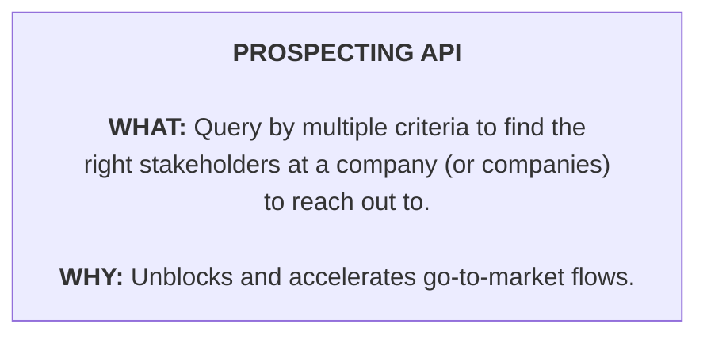
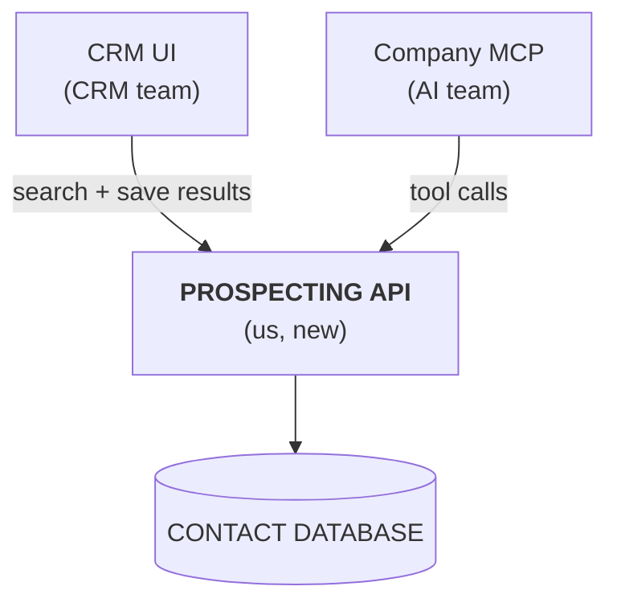
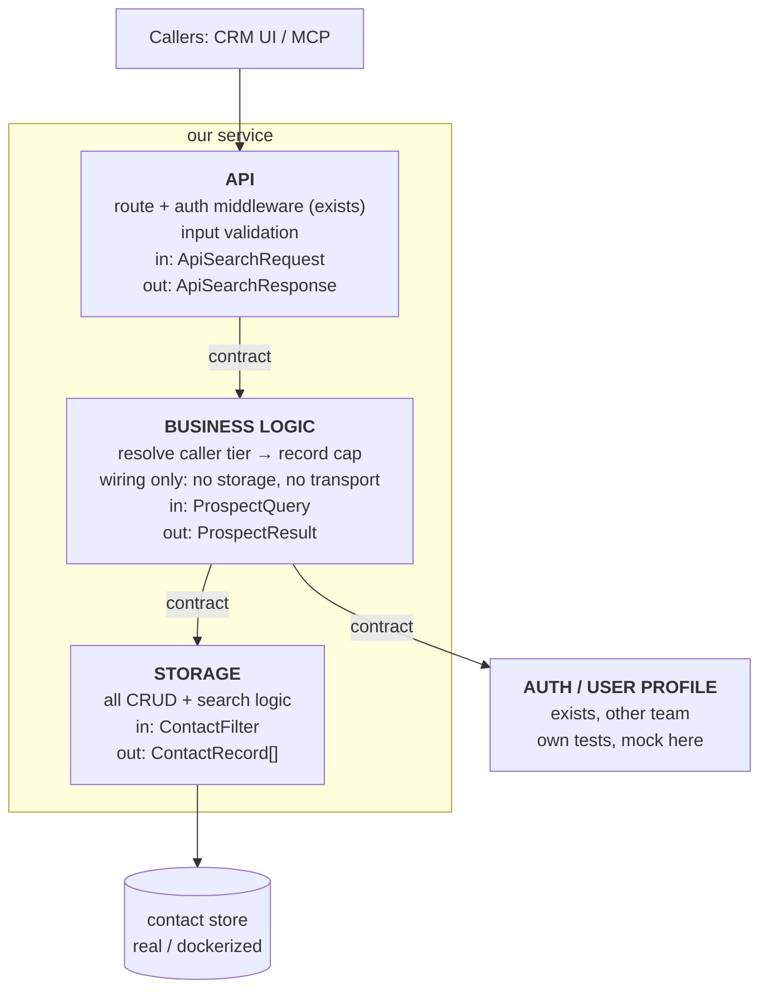

# Worked example — Prospecting API

One system drawn at every altitude. The system is deliberately trivial: an API that queries a contact database and shapes the response by caller tier. Assume auth, user profiles, and contact sourcing already exist.

Match this shape, not this content. Real breakdowns are sized to the problem.

## 50,000 ft

One box. No technology, no integrations.

## 10,000 ft

*Existing systems (auth, user profiles, contact sourcing) are assumed and not drawn.*

What this altitude surfaces: two conversations to have — the CRM team for saving results, the AI team for the MCP integration — and that both are blocked on the Prospecting API's edge contract, not on its implementation.

## Implementation

| Box | Owns | Tested against |
|---|---|---|
| API | transport, validation, auth wiring, status mapping | mocked business logic |
| Business logic | tier → record cap, wiring | mocked storage and auth |
| Storage | query construction, driver concerns | real or containerized store |
| Integration | nothing new | the whole product, from the outside |

Six payload types: every box owns its own input and output. On day one `ApiSearchRequest` and `ProspectQuery` look identical — they stay separate anyway.

**Build order.** Define the API contract first — CRM and AI teams mock against it and start in parallel. Build storage first (leaf, no dependencies), then business logic, then API. Integration with CRM UI and MCP last.

**Milestones.** Contract published → storage done → prospecting usable behind the API → CRM and MCP integrated. Each milestone is a point where a blocked item becomes unblocked.

## Composability check

| Change | Lands in |
|---|---|
| Enterprise tier gets more results | business logic + its test |
| Add rate limiting | API only |
| Replace the database backend | storage only; no upstream test changes if the contract held |
| New enrichment product on the same data | reuse storage as-is |
| Add a gRPC entrypoint | new exposure box; reuse business logic as-is |

If a change in this table would touch more than the listed box, the decomposition is wrong.
